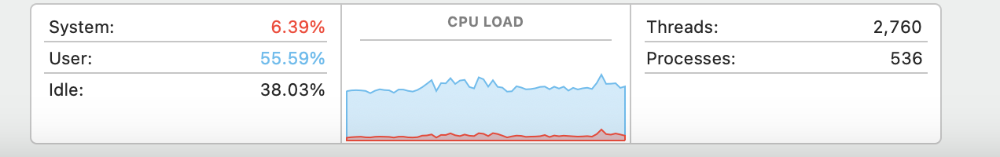
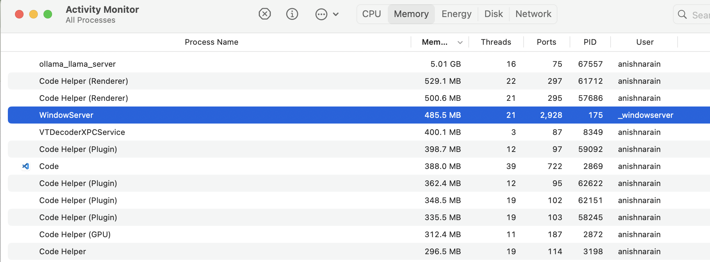
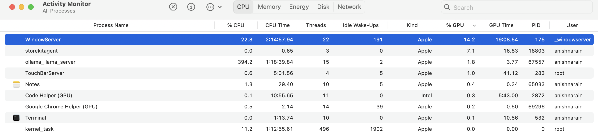
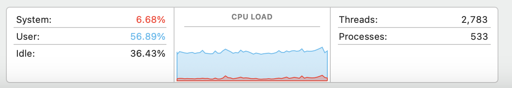
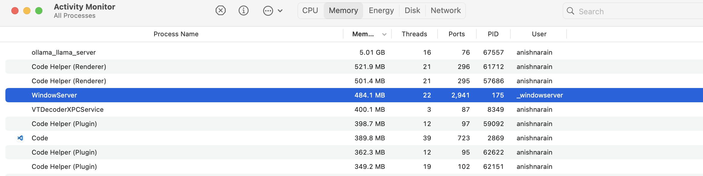
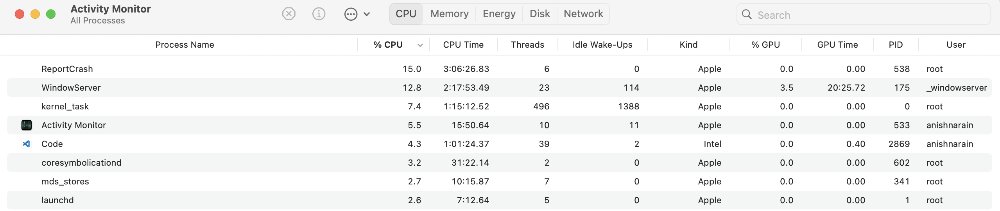
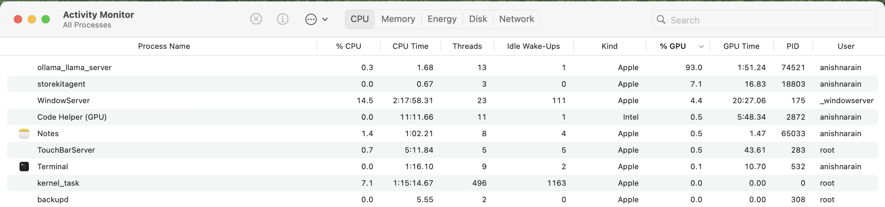

# Scaling Up Locally 

I didn't get a screenshot of activity monitor for this, but:

### #1 `p-without-gpy.py`
```
Patient Number: 0, HADM ID: 20015730, Discharge Text Length: 24729, Pneumonia Detected: Yes, Time Taken: 68
Patient Number: 1, HADM ID: 20022465, Discharge Text Length: 9219, Pneumonia Detected: No, Time Taken: 24
Patient Number: 2, HADM ID: 20025172, Discharge Text Length: 29166, Pneumonia Detected: Yes, Time Taken: 64
Patient Number: 3, HADM ID: 20031665, Discharge Text Length: 9779, Pneumonia Detected: No, Time Taken: 23
Patient Number: 4, HADM ID: 20038242, Discharge Text Length: 10198, Pneumonia Detected: Yes, Time Taken: 26
Patient Number: 5, HADM ID: 20050336, Discharge Text Length: 16691, Pneumonia Detected: Yes, Time Taken: 43
Patient Number: 6, HADM ID: 20060499, Discharge Text Length: 7772, Pneumonia Detected: Yes, Time Taken: 20
Patient Number: 7, HADM ID: 20067108, Discharge Text Length: 3581, Pneumonia Detected: No, Time Taken: 10
Patient Number: 8, HADM ID: 20068469, Discharge Text Length: 18635, Pneumonia Detected: Yes, Time Taken: 44
Patient Number: 9, HADM ID: 20069079, Discharge Text Length: 12459, Pneumonia Detected: Yes, Time Taken: 32
```

### #2 `p-with-gpu.py`
**CPU**



**MEMORY**


```
Patient Number: 0, HADM ID: 20015730, Discharge Text Length: 24729, Pneumonia Detected: Yes, Time Taken: 193
Patient Number: 1, HADM ID: 20022465, Discharge Text Length: 9219, Pneumonia Detected: Yes, Time Taken: 73
Patient Number: 2, HADM ID: 20025172, Discharge Text Length: 29166, Pneumonia Detected: Yes, Time Taken: 196
Patient Number: 3, HADM ID: 20031665, Discharge Text Length: 9779, Pneumonia Detected: No, Time Taken: 72
Patient Number: 4, HADM ID: 20038242, Discharge Text Length: 10198, Pneumonia Detected: Yes, Time Taken: 79
Patient Number: 5, HADM ID: 20050336, Discharge Text Length: 16691, Pneumonia Detected: Yes, Time Taken: 136
Patient Number: 6, HADM ID: 20060499, Discharge Text Length: 7772, Pneumonia Detected: Yes, Time Taken: 65
Patient Number: 7, HADM ID: 20067108, Discharge Text Length: 3581, Pneumonia Detected: No, Time Taken: 32
Patient Number: 8, HADM ID: 20068469, Discharge Text Length: 18635, Pneumonia Detected: Yes, Time Taken: 139
Patient Number: 9, HADM ID: 20069079, Discharge Text Length: 12459, Pneumonia Detected: Yes, Time Taken: 103
```

### #3 `p-without-gpu.py` (after just having run `p-with-gpu.py`)
**CPU**



**MEMORY**


```
Patient Number: 0, HADM ID: 20015730, Discharge Text Length: 24729, Pneumonia Detected: Yes, Time Taken: 191
Patient Number: 1, HADM ID: 20022465, Discharge Text Length: 9219, Pneumonia Detected: Yes, Time Taken: 72
Patient Number: 2, HADM ID: 20025172, Discharge Text Length: 29166, Pneumonia Detected: Yes, Time Taken: 204
Patient Number: 3, HADM ID: 20031665, Discharge Text Length: 9779, Pneumonia Detected: No, Time Taken: 97
Patient Number: 4, HADM ID: 20038242, Discharge Text Length: 10198, Pneumonia Detected: Yes, Time Taken: 103
Patient Number: 5, HADM ID: 20050336, Discharge Text Length: 16691, Pneumonia Detected: Yes, Time Taken: 182
Patient Number: 6, HADM ID: 20060499, Discharge Text Length: 7772, Pneumonia Detected: Yes, Time Taken: 93
Patient Number: 7, HADM ID: 20067108, Discharge Text Length: 3581, Pneumonia Detected: No, Time Taken: 43
Patient Number: 8, HADM ID: 20068469, Discharge Text Length: 18635, Pneumonia Detected: Yes, Time Taken: 163
Patient Number: 9, HADM ID: 20069079, Discharge Text Length: 12459, Pneumonia Detected: Yes, Time Taken: 106
```

### #4 `p-without-gpu.py` (after doing pgrep and then kill)



### Findings
- Specifying num_gpu messes it up (so that when I run the old code without gpu, it is just as slow. The only thing that fixes it is killing the port (`pgrep ollama` and then `kill {port number}`)
- At the moment even code that does not specify the num_gpu=1 still uses the GPU. So I guess I don’t really need to change the code? At least not locally
- Documentation about benchmarks for different GPUs and llama3 inference: https://github.com/XiongjieDai/GPU-Benchmarks-on-LLM-Inference?tab=readme-ov-file